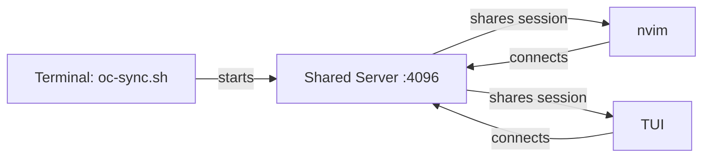

# Bidirectional TUI/nvim Sync

Switch seamlessly between opencode TUI and nvim plugin without losing context.


## Problem

Switching between opencode TUI and nvim plugin feels like using two separate tools:

1. **Session isolation** - Start a conversation in TUI, switch to nvim, your context is lost
2. **Double initialization** - Each interface spawns its own server, wasting 15-20s on MCP loading every time
3. **Mental overhead** - You have to remember which interface you were using for what task

You want TUI for complex workflows and nvim for quick code edits, seamlessly.

## Solution

Use a single shared HTTP server that both TUI and nvim connect to:

- Start server once, use from any interface
- Session state persists across TUI/nvim switches  
- Zero context loss when changing tools

## State Flow



## Quick Start

### 1. Install Wrapper

```bash
chmod +x oc-sync.sh
cp oc-sync.sh ~/.local/bin/
```

### 2. Configure Nvim

Add to your opencode.nvim setup:

```lua
server = {
    url = "localhost",
    port = 4096,
    timeout = 30,  -- First boot can be slow (MCP initialization)
    auto_kill = false,  -- Keep server alive when TUI is active
    spawn_command = function(port, url)
        local script = vim.fn.expand("~/.local/bin/oc-sync.sh")
        vim.fn.system(script .. " --sync-ensure")
        return nil  -- Server lifecycle managed externally
    end,
}
```

### 3. Use It

Terminal 1 - Start TUI:
```bash
oc-sync.sh /path/to/project
```

Terminal 2 - Open nvim in same directory:
```bash
cd /path/to/project && nvim
```

Both will share the same session state.

## Implementation Notes

- `oc-sync.sh --sync-ensure` starts shared HTTP server (port 4096)
- TUI runs `opencode attach <endpoint>` to connect
- Nvim plugin connects to same endpoint
- Server stays alive until manually killed

## Customization

Environment variables:

| Variable | Default | Description |
|----------|---------|-------------|
| `OPENCODE_SYNC_PORT` | 4096 | HTTP server port |
| `OPENCODE_SYNC_HOST` | 127.0.0.1 | Server bind address |
| `OPENCODE_SYNC_WAIT_TIMEOUT_SEC` | 20 | Startup timeout |

## Troubleshooting

**Port already in use?**
```bash
# Check what's using it
lsof -i :4096

# Kill the process
kill $(lsof -t -i :4096)
```

**MCP plugins taking too long?**
```bash
# Increase timeout
export OPENCODE_SYNC_WAIT_TIMEOUT_SEC=60
```

**Server not responding?**
```bash
# Check health
curl http://localhost:4096/global/health
```

## Integration Ideas

- Combine with [three-state-layout](../three-state-layout/README.md) to also control how you view opencode within nvim
- Use terminal multiplexers (tmux/zellij) to manage both TUI and nvim in one window
- Add shell aliases for common project paths
