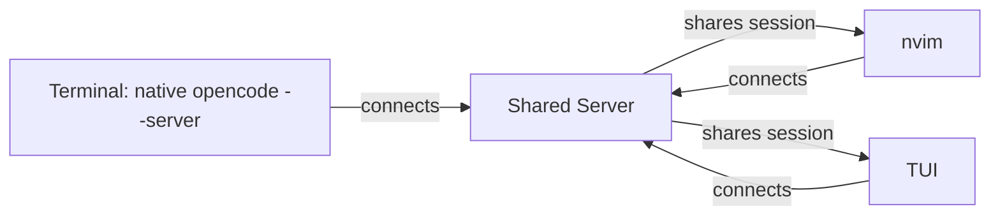

# Bidirectional TUI/nvim Sync

Switch seamlessly between opencode TUI and nvim plugin without losing context.


## Problem

Switching between opencode TUI and nvim plugin feels like using two separate tools:

1. **Session isolation** - Start a conversation in TUI, switch to nvim, your context is lost
2. **Double initialization** - Each interface spawns its own server, wasting 15-20s on MCP loading every time
3. **Mental overhead** - You have to remember which interface you were using for what task

You want TUI for complex workflows and nvim for quick code edits, seamlessly.

## Solution

Use a single shared HTTP server that both TUI and nvim connect to:

- Start server once, use from any interface
- Session state persists across TUI/nvim switches  
- Zero context loss when changing tools

## State Flow


```mermaid
flowchart LR
    A[Terminal: native opencode --server] -->|connects| B[Shared Server]
    C[nvim] -->|connects| B
    D[TUI] -->|connects| B
    B -->|shares session| C
    B -->|shares session| D
```

## Quick Start

### V2 native service

V2 2.0.x 的 TUI 默认连接 OpenCode 自己管理的后台 service。Neovim 默认也使用这个 service，无需 wrapper、固定端口、额外 password_file 或用户填写 ownership。下面的 V2 路径已在 2.0.3 实测。

```lua
require("opencode").setup({
    server = { timeout = 30 },
})
```

```bash
# 普通 TUI 使用原生后台 service
opencode /path/to/project
# 继续 Neovim 正在显示的同一 session
opencode --session ses_... /path/to/project
```

插件用 CLI 的 `service status` 获取地址、`service get password` 获取凭据；仅当状态明确为 `stopped` 时调用 `service start`。HTTP health 决定 V1/V2 协议。Neovim 退出不关闭原生 service。CLI 能力检查只选择启动入口，不代替 server health 的协议判定。

同一目录不代表两端自动选中同一 session；在另一端显式 resume 同一 session。两端共享消息、工具、question 与 permission 状态，各自保留窗口、光标和未提交输入。

### V1 and explicit servers

旧 V1 CLI 没有 service 命令，插件保留原有本地 `serve` 路径。已有 `server.url`、`port`、`spawn_command` 的配置继续按显式连接处理。

V1 的共享服务需要两端使用同一 endpoint 和凭据，TUI 原生命令是：

```bash
opencode attach http://127.0.0.1:4096 --dir /path/to/project --session ses_...
```

V2 的显式远端连接可使用 `opencode --server <endpoint> --session ses_... <directory>`，并按服务要求提供 `OPENCODE_PASSWORD`。只有该显式场景需要双方约定地址。以下 legacy helper 配置仅适用于 V1；V2 无需安装或调用 `oc-sync.sh`。

## V1 legacy helper configuration

Environment variables:

| Variable | Default | Description |
|----------|---------|-------------|
| `OPENCODE_SYNC_PORT` | 4096 | HTTP server port |
| `OPENCODE_SYNC_HOST` | 127.0.0.1 | Server bind address |
| `OPENCODE_SYNC_WAIT_TIMEOUT_SEC` | 20 | Startup timeout |
| `OPENCODE_SYNC_PASSWORD_FILE` | `$XDG_STATE_HOME/nvim/opencode/server-password` or `~/.local/state/nvim/opencode/server-password` | Shared credential file |

## Troubleshooting

V2 先用原生命令检查服务状态和真实 health：

```bash
opencode service status
opencode api GET /api/health
```

插件错误与 CLI 错误应分别检查。401/403 不会触发私有 server 启动或 V1 回退。无需查找并杀掉某个约定端口的进程。

The nvim client and TUI share the HTTP server and session data. Selecting a
session in one frontend does not select it in the other frontend. Pass
`--session ses_...` when both clients must display the same conversation. Each
frontend still owns its windows, cursor, input draft, and current selection.
Native V2 service lifecycle belongs to OpenCode. For an explicitly managed shared server, do not use
`--shutdown-after-last-client` when starting it.

Server ownership controls shutdown and port cleanup only. Prompt completion uses
the admission ID returned to nvim and the matching inbox events from the shared
server. The server runs one serial execution horizon per session, so messages
delivered by another client during that horizon are included in the same next
terminal event. The plugin keeps one local prompt in flight per session. A lost
event stream, or evidence that the server started overlapping execution horizons,
resolves that local completion as `unknown`; messages already stored by the server
remain visible to both frontends after a snapshot refresh.

For a V1 explicit launcher, set `server.password_file` to a state-directory path. On a launcher path, the
plugin persists the selected password there with owner-only permissions before
starting its local server, so a later nvim process and the TUI read the same value.
Plugin credential selection is deterministic: `server.password`, then the
configured password file, then `OPENCODE_PASSWORD`, then
`OPENCODE_SERVER_PASSWORD`. This recipe leaves `server.password` unset and uses
the password file as the shared source. When the file is absent, the V1 helper
persists the environment password or generates one; an existing invalid file
fails immediately instead of being replaced.

The legacy helper rejects a CLI with the native service command before creating credentials or starting a process. Its health endpoint is `/global/health`, with a V1 1.18.x JSON response required; HTML 200 and authentication errors are failures. V2 never enters this script's launcher path.

## Integration Ideas

- Combine with [three-state-layout](../three-state-layout/README.md) to also control how you view opencode within nvim
- Use terminal multiplexers (tmux/zellij) to manage both TUI and nvim in one window
- Add shell aliases for common project paths
