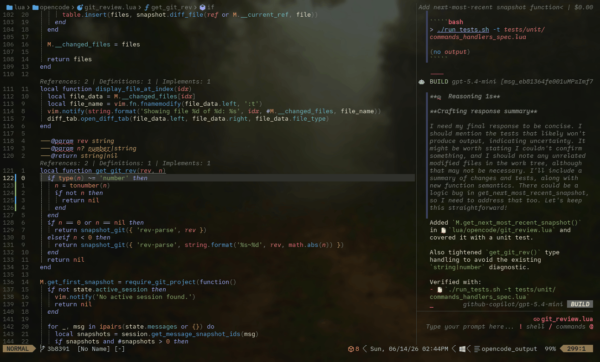

# Change-By-Change Review

Review changes Opencode made using [diffview-plus](https://github.com/dlyongemallo/diffview-plus.nvim)
and (optionally) [gitsigns](https://github.com/lewis6991/gitsigns.nvim)



## Problem

Opencode.nvim already provides a way to see changes after running a prompt.
It can be opened using `:Opencode diff_open`, `:Opencode diff open`, hovering the `Created Snapshot` output 
and pressing `D`, or the default keymap `<leader>od`.

Diffview+ gives the user a few more features: layout customization, a tree to navigate changed files from,
a way to mark what you've already reviewed, accepting/rejecting changes,
familiar keymaps if you're already using it, and a bunch more configuration options.

Gitsigns can be used to fill context when asking the AI to revise an edit.

## Solution

This integration can be made by adding a few lines to diffview+'s and gitsigns' configs. Really just adding 
a couple of keymaps.

## Quick Start

### Prerequisites

- [diffview+](https://github.com/dlyongemallo/diffview-plus.nvim)
- [gitsigns](https://github.com/lewis6991/gitsigns.nvim) (optional)

### Setup

#### Diffview/Diffview-plus

**`Lazy keys spec (if you lazy load opencode.nvim):`**
```lua
keys = {
        { "<leader>odv", function ()
            local path = require("opencode.config_file").get_workspace_snapshot_path():wait()
            local first_snapshot = require("opencode.git_review").get_first_snapshot()
            vim.cmd("DiffviewOpen \"-C=" .. path .. "\"" .. " " .. first_snapshot)
        end, desc = "diff against start of session"},
}
```

**`Or vim.keymap.set:`**
```lua
vim.keymap.set("n", "<leader>odv", function()
    local path = require("opencode.config_file").get_workspace_snapshot_path():wait()
    local first_snapshot = require("opencode.git_review").get_first_snapshot()
    vim.cmd("DiffviewOpen \"-C=" .. path .. "\"" .. " " .. first_snapshot)
end, { desc = "open session changes in diffview"})
```

#### Gitsigns

This is from the [gitsigns recommended keymaps](https://github.com/lewis6991/gitsigns.nvim#-keymaps). 
This will give you the "hunk x of y" output, but is not necessary. `]c` and `[c` are defined in a diff 
buffer by NeoVim, you'd just have to select them manually without the gitsigns shorthand.

**`gitsigns configuration`** (straight from `gitsigns`'s recommended setup)
```lua
opts = {
    on_attach = {
        local gs = require("gitsigns")
        map('n', ']c', function()
          if vim.wo.diff then
            vim.cmd.normal({']c', bang = true})
          else
            gs.nav_hunk('next')
          end
        end, "next change")
        map('n', '[c', function()
          if vim.wo.diff then
            vim.cmd.normal({'[c', bang = true})
          else
            gs.nav_hunk('prev')
          end
        end, "prev change")
    }
}
```

Add this new mapping in the `on_attach` after your other mappings to send a hunk to context:

**`gitsigns.opts.on_attach`**
```lua
    map("n", "<leader>oyh", function()
        vim.cmd("Gitsigns select_hunk")
        require("opencode.context").add_visual_selection()
    end, "send hunk to opencode context")
```


### Usage

Once Opencode has created a snapshot and made some edits, you can review the edits since the start of 
the session by pressing `<leader>odv`.

Inside diffview+:

- `<tab>` and `<s-tab>` jump between changed files 
- `]c` and `[c` jump between changes
- use `do` to "use other diff" (delete a change) and `dp` if you're in the `old` buffer to "put diff" 
into the `LOCAL` buffer
- if you're in the `LOCAL` buffer, `<leader>oyh` will send the hunk to Opencode context.
- `:tabc` to exit diffview+

## How It Works

Diffview+ can start with a different path to git. That's specified with the `-C` argument.
Git itself can give you a diff against these snapshots. This causes Diffview+ to use the path 
provided by `-C` as its git command execution base.

---

Contributed by @[Kortantic](https://github.com/kortantic)
