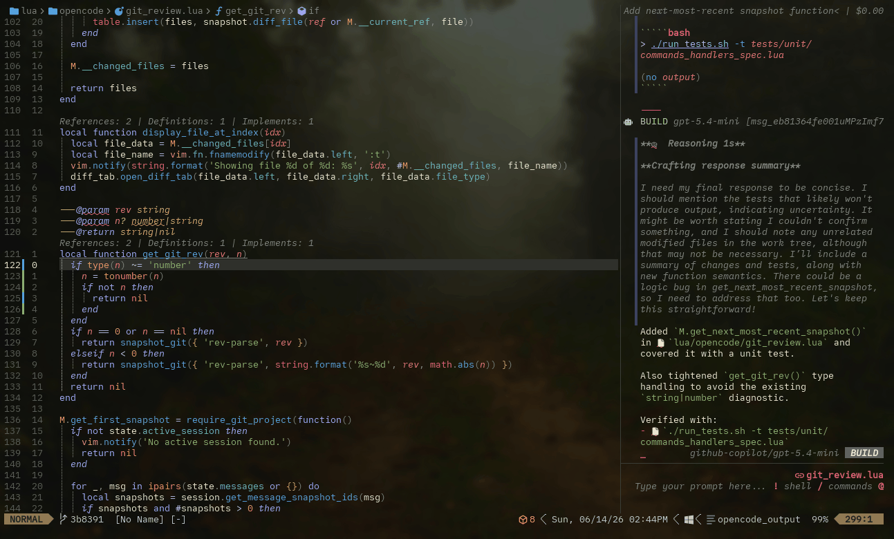

# Change-by-change review

[Recipes](../README.md) / Change-by-change review

Review legacy V1 snapshot changes through
[diffview-plus](https://github.com/dlyongemallo/diffview-plus.nvim), with optional
[gitsigns](https://github.com/lewis6991/gitsigns.nvim) hunk navigation.



## When to use it

Use this if you already prefer diffview-plus and are working with **OpenCode V1
snapshots**. For V2, use the built-in [session diff review](../../review.md): it
has a file tree, range selection, and inline comments without this integration.

V1 snapshots are experimental. This recipe relies on plugin internals, not a
stable external snapshot API, so check it again after upgrades.

## Prerequisites

- OpenCode V1 and an active session with at least one snapshot.
- diffview-plus installed and configured.
- gitsigns, if you want the optional hunk mappings.

## Setup

Add this mapping after configuring opencode.nvim and diffview-plus:

```lua
vim.keymap.set('n', '<leader>odv', function()
  local path = require('opencode.config_file').get_workspace_snapshot_path():wait()
  local first_snapshot = require('opencode.git_review').get_first_snapshot()
  vim.cmd('DiffviewOpen "-C=' .. path .. '" ' .. first_snapshot)
end, { desc = 'Review V1 session in diffview-plus' })
```

For optional hunk navigation and sending a hunk as context, merge this
`on_attach` into your gitsigns setup. This is a lazy.nvim spec; keep any existing
`on_attach` behavior when combining it with your own configuration.

```lua
return {
  'lewis6991/gitsigns.nvim',
  opts = {
    on_attach = function(bufnr)
      local gs = require('gitsigns')
      local function map(lhs, callback, desc)
        vim.keymap.set('n', lhs, callback, { buffer = bufnr, desc = desc })
      end
      map(']c', function()
        if vim.wo.diff then
          vim.cmd.normal({ ']c', bang = true })
        else
          gs.nav_hunk('next')
        end
      end, 'Next change')
      map('[c', function()
        if vim.wo.diff then
          vim.cmd.normal({ '[c', bang = true })
        else
          gs.nav_hunk('prev')
        end
      end, 'Previous change')
      map('<leader>oyh', function()
        gs.select_hunk()
        require('opencode.api').add_visual_selection({ open_input = false })
      end, 'Send hunk to OpenCode')
    end,
  },
}
```

## Try it

1. Let a V1 session create a snapshot and make an edit.
2. Press `<leader>odv` to review changes since the first session snapshot.
3. In diffview-plus, use `<Tab>` / `<S-Tab>` for files and `]c` / `[c` for hunks.
4. In a working file with gitsigns attached, `<leader>oyh` selects the hunk and
   adds it to OpenCode context. Inspect it before sending a follow-up.
5. Close the review tab with `:tabclose`.

## Caveats and undo

diffview-plus uses `-C` to run Git against the snapshot directory. This does not
turn V2 session revisions into a Git repository.

In diff windows, `do` takes the other side's change; `dp` puts the current side's
change into the other buffer. These edit buffers, so inspect the target side and
save or back up work before using them. Follow diffview-plus's own documentation
for accepting/rejecting changes.

Remove `<leader>odv` and the optional gitsigns mappings to undo this recipe.

Contributed by [Kortantic](https://github.com/Kortantic).
