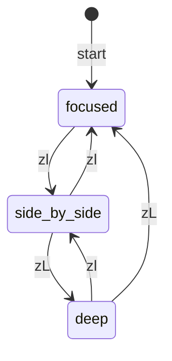

# Three-State Layout Toggle

Instantly switch how you view opencode.

## Problem

Real workflows need three distinct ways to interact with AI:

1. **Focused coding** - opencode hidden, full attention on your code
2. **Side-by-side** - opencode visible alongside code, quick reference and iteration
3. **Deep conversation** - opencode fullscreen for complex AI interactions requiring full context

The default `toggle()` only provides binary visible/hidden control. Switching between these three modes requires multiple keypresses and interrupts flow.

## State Transitions



## Demo

Run the standalone demo:

```vim
:luafile docs/recipes/three-state-layout/demo.lua
```

Then press `zl` or `zL` to toggle between modes.


## Keybindings

| Key | Focused coding | Side-by-side | Deep conversation |
|-----|----------------|--------------|-------------------|
| `zl` | Enter side-by-side | Return to focused | Exit to side-by-side |
| `zL` | Enter deep conversation | Switch to deep | Return to focused |

## Implementation Notes

The demo uses `config.ui.position` to switch between window layouts:
- `position = 'right'` for side-by-side mode
- `position = 'current'` for deep conversation mode

## Integration Ideas

- Combine with [bidirectional-sync](../bidirectional-sync/README.md) to also share sessions between TUI and nvim
- Add autocmds to automatically enter deep conversation mode on long AI responses
- Map to leader keys for easier access
- Use with tmux/zellij for managing multiple opencode instances
